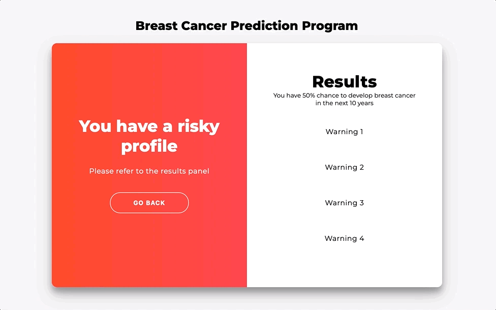

<!-- PROJECT LOGO -->
 

<h3 align="center">Cloud Data prediction Program</h3>

        Heart Disease / Breast Cancer dataset

## Spark

Folder spark contain the back end algorithm of the dataset prediction program.
 
Run with python3
- After installing dependencies with : pip install ... or pip3 install
> python3 heart_failure_app.py
or
> python heart_failure_app.py

## Streamlit

Folder Streamlit contain the front end architecture with data set prediction.
 
Run wirh python 3.
- After installing dependencies with : pip install ... or pip3 install ...
Run with :
> streamlit run heart_failure_app.py

## Html

Front-end architecture.
 

 / 
